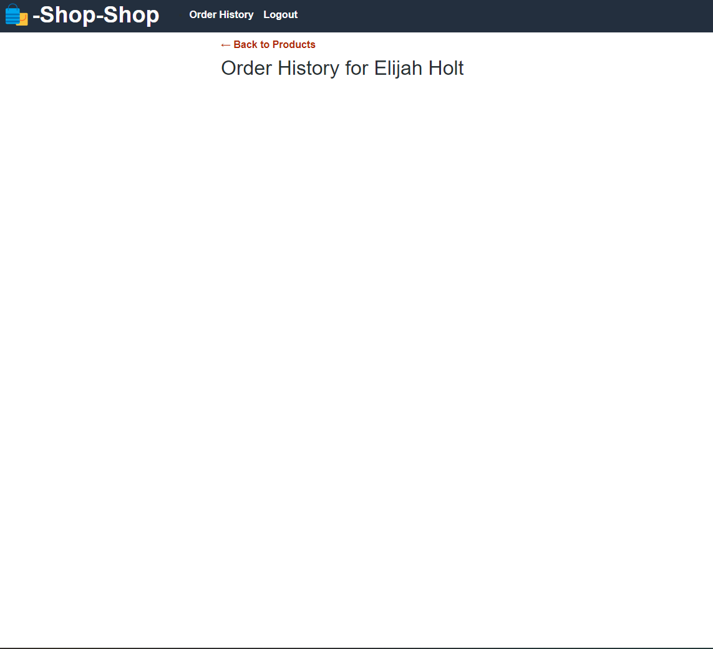

# redux-store
# Description 📈
```md
AS a senior engineer working on an e-commerce platform
I WANT my platform to use Redux to manage global state instead of the Context API
SO THAT my website's state management is taken out of the React ecosystem
```

# Acceptance Criteria 📝
```md
GIVEN an e-commerce platform that uses Redux to manage global state
WHEN I review the app’s store
THEN I find that the app uses a Redux store instead of the Context API
WHEN I review the way the React front end accesses the store
THEN I find that the app uses a Redux provider
WHEN I review the way the app determines changes to its global state
THEN I find that the app passes reducers to a Redux store instead of using the Context API
WHEN I review the way the app extracts state data from the store
THEN I find that the app uses Redux instead of the Context API
WHEN I review the way the app dispatches actions
THEN I find that the app uses Redux instead of the Context API
```
# Table of Contents 📓

- [redux-store](#redux-store)
- [Description 📈](#description-)
- [Acceptance Criteria 📝](#acceptance-criteria-)
- [Table of Contents 📓](#table-of-contents-)
- [Installation 💻](#installation-)
- [Usage 📎](#usage-)
- [License 📂](#license-)
- [Contributing 🔍](#contributing-)
- [Questions ❓📧❔](#questions-)

# Installation 💻

- npm i (to install all dependencies)
- npm start (to start the app)

# Usage 📎

Live Heroku Link: https://jheeebert-redux-store-26f3a438bda0.herokuapp.com/

   <strong>Main Page</strong> <br>
    <br>
   <strong>Cart</strong> <br>
    <br>
   <strong>Order History</strong> <br>
    <br>


# License 📂
[](https://github.com/Naereen/StrapDown.js/blob/master/LICENSE)

# Contributing 🔍

[Contributors Covenant](https://www.contributor-covenant.org/) <br>

1. Fork the repository on GitHub.
2. Create a new branch with a descriptive name: `git checkout -b my-branch`
3. Make the necessary changes and commit them: ` git commit -m "Description of changes"`
4. Push your changes to your forked repository: `git push origin my-branch`
   <br>
   [](https://GitHub.com/Jheeebert/redux-store/commit/)
   [](https://GitHub.com/Jheeebert/redux-store/commit/)
   [](https://GitHub.com/Jheeebert/redux-store/network/)
   <br>
# Questions ❓📧❔

[](https://GitHub.com/Jheeebert/redux-store) <br>
* If you have any questions about the repo, open an issue @ link above or contact me directly at:  📧 wdfuzz8823@gmail.com 📧. <br>
* You can find more of my work at 🔖 [Jheeebert](https://github.com/Jheeebert/) 🔖. <br>
[](http://commonmark.org)