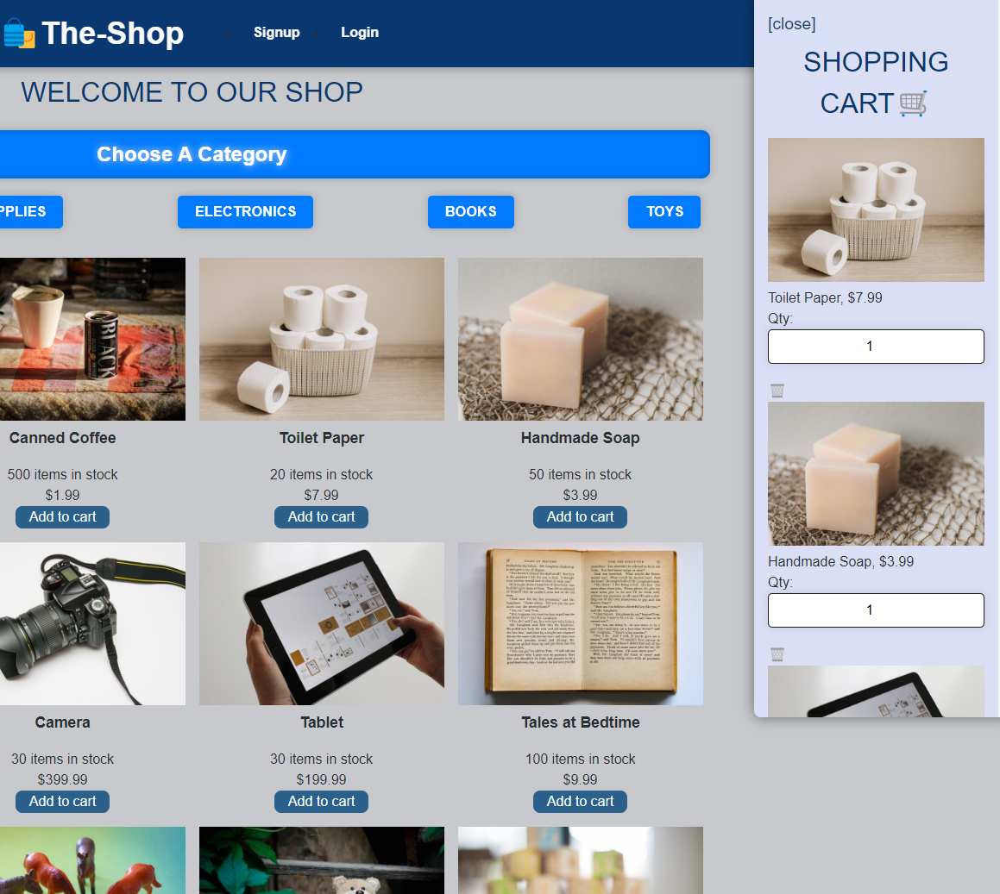

# Redux Store 🛍️
## Description
As a senior engineer working on an e-commerce platform, I aimed to manage the platform's global state using Redux instead of the Context API. This move enhances the platform's state management, removing it from the React ecosystem.
## Table of Contents
- [Redux Store 🛍️](#redux-store-️)
  - [Description](#description)
  - [Table of Contents](#table-of-contents)
  - [Installation](#installation)
  - [Usage](#usage)
    - [Screenshots](#screenshots)
  - [License](#license)
  - [Contributing](#contributing)
  - [Questions](#questions)
## Installation
To get started, follow these steps:
1. Clone the repository: `git clone https://github.com/Jheeebert/redux-store.git`
2. Navigate to the project directory: `cd redux-store`
3. Install the dependencies: `npm install`
4. Start the application: `npm start`
## Usage
Explore the live Heroku demo [here](https://jheeebert-redux-store-26f3a438bda0.herokuapp.com/).
### Screenshots

## License

## Contributing
We welcome contributions! If you'd like to contribute, please follow these steps:
1. Fork the repository on GitHub.
2. Create a new branch: `git checkout -b my-branch`
3. Make your changes and commit them: `git commit -m "Description of changes"`
4. Push to your branch: `git push origin my-branch`
5. Open a pull request [here](https://github.com/Jheeebert/redux-store/pulls)
## Questions
Feel free to reach out if you have any questions:
- GitHub: [Jheeebert](https://github.com/Jheeebert/)
- Email: jheeebertwd@gmail.com
